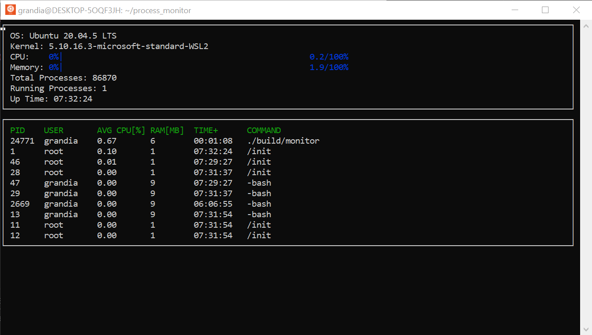

# Linux System Monitor

A htop-like system monitor implemented in C++



## Requirements

* [ncurses](https://www.gnu.org/software/ncurses/)
    `sudo apt install libncurses5-dev libncursesw5-dev`

* gcc/g++ 9.4.0

Tested on Ubuntu 20.04

## Compiling

This project uses [Make](https://www.gnu.org/software/make/). The Makefile has four targets:
* `build` compiles the source code and generates an executable
* `format` applies [ClangFormat](https://clang.llvm.org/docs/ClangFormat.html) to style the source code
* `debug` compiles the source code and generates an executable, including debugging symbols
* `clean` deletes the `build/` directory, including all of the build artifacts

## Running the project

```
make build
./build/monitor
```